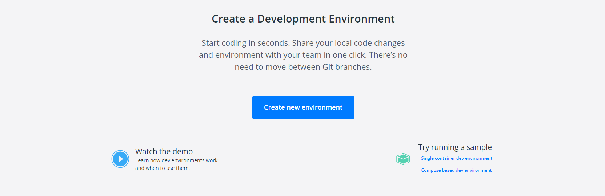
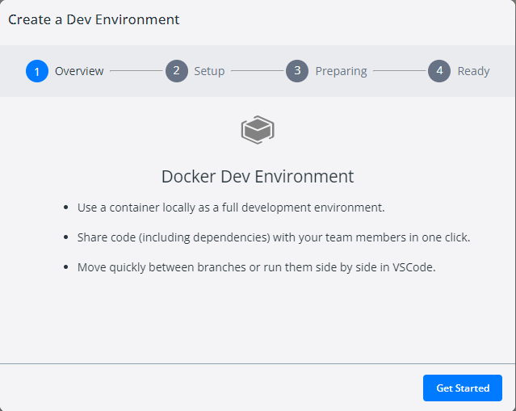
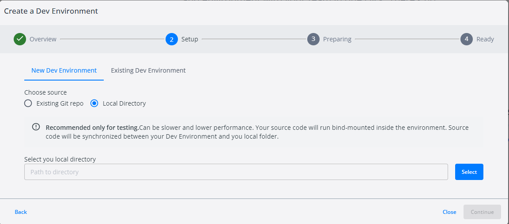
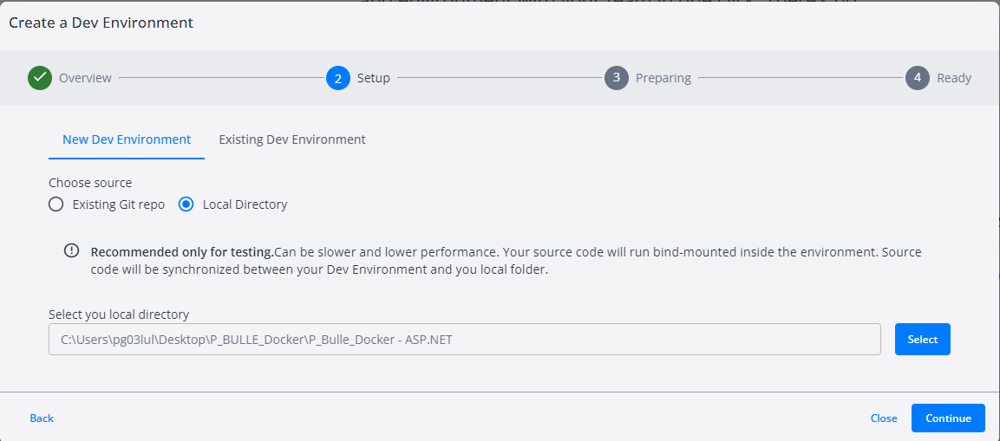

# P_Bulle_Dev_Docker

## Config de docker et des containeurs

### Creation du containeur avec DevEnvironments

Quand vous lancer Docker, vous devez cliquer sur l'icône DevEnvironments à Gauche

Cliquer sur le bouton Create new environment  
  

Cette Fenêtre vous informe juste de Docker Dev Environment. Cliquer sur Get Started  


Vous arrive sur cetee fenêtre. Vous pouvez utiliser sois un projet GIT ou un dossier local. Dans cet documentation je vais utilisé un dossier local.


Vous chochez votre option. Dans le cas d'un dossier local, il faudra choisir un dossier avec le button Select en bas à droite


Après votre dossier choisi. Cliquer sur Continue qui vient d'apparaître.


Vous n'avez à présent plus rien à faire attendez que le téléchargement finisse et cliquer sur continuer.


Voila votre environment de développement à été contenerisée. Vous pouvez l'ouvrir avec votre IDE.


### Commande pour lancer notre application

```shell
# Permet d'ouvrir une session root temporaire
sudo -i

# Elle permet de Rechercher les mises à jour disponibles, télécharger et installer les mises à jour.
apt-get upgrade

# Permet d'installer le programme sudo
apt-get install sudo

# Permet de mettre à jour les paquets disponibles
sudo apt update

# Permet d'installer les outils nécessaires pour télécharger des fichiers depuis Internet.
sudo apt install -y wget apt-transport-https software-properties-commo

# Permet de téléchargez les fichiers à partire de l'url et -O permet de spécifier le nom des fichiers de sorties.
wget https://packages.microsoft.com/config/debian/11/packages-microsoft-prod.deb -O packages-microsoft-prod.deb

# Permet d' installer le package dans le système
sudo dpkg -i packages-microsoft-prod.deb

# Permet de mettre à jour les paquets disponibles
sudo apt update

# Permet d'installer le package ASP-NET runtime avec la version 6.0
sudo apt install -y aspnetcore-runtime-6.0

# Permet de mettre à jour les paquets disponibles
sudo apt update

# Permet d'installer le package .NET-SDK avec la version6.0
sudo apt install -y dotnet-sdk-6.0

# Permet de reculer d'un dossier pour ce mettre à la racine
cd ..

# Entre dans le dossier bin
cd bin

# Entre dans le dossier Debug
cd Debug

# Entre dans le dossier net6.0
cd net6.0

# Lance l'application .NET CORE
dotnet P_Bulle_Docker.dll
```

### DockerFile

```dockerfile
# Il utilise l'image de base mcr.microsoft.com/dotnet/aspnet:6.0, qui contient l'environnement d'exécution ASP.NET Core.
FROM mcr.microsoft.com/dotnet/aspnet:6.0 AS base

# Définit le répertoire de travail comme /app.
WORKDIR /app

# Expose les ports 80 et 443 qui sont généralement utilisés pour le trafic HTTP et HTTPS.
EXPOSE 80
EXPOSE 443

# Utilise l'image mcr.microsoft.com/dotnet/sdk:6.0 en tant que base, qui contient l'environnement de développement .NET Core.
FROM mcr.microsoft.com/dotnet/sdk:6.0 AS build

# Définit le répertoire de travail comme /src.
WORKDIR /src

# Copie le fichier de projet P_Bulle_Docker.csproj dans le répertoire de travail.
COPY ["P_Bulle_Docker.csproj", "."]

# Exécute la commande dotnet restore pour restaurer les dépendances du projet.
RUN dotnet restore "./P_Bulle_Docker.csproj"

# Copie tout le contenu du répertoire actuel dans le répertoire de travail.
COPY . .

# Modifie le répertoire de travail vers /src/.
WORKDIR "/src/."

# Exécute la commande dotnet build pour construire l'application en mode Release et la place dans le répertoire /app/build.
RUN dotnet build "P_Bulle_Docker.csproj" -c Release -o /app/build

# Utilise l'étape de construction comme base.
FROM build AS publish

# Exécute la commande dotnet publish pour créer une version publiée de l'application dans le répertoire /app/publish.
RUN dotnet publish "P_Bulle_Docker.csproj" -c Release -o /app/publish

# Utilise l'étape de base comme base.
FROM base AS final

# Définit le répertoire de travail comme /app.
WORKDIR /app

# Copie le contenu du répertoire de publication depuis l'étape précédente.
COPY --from=publish /app/publish .

# Définit le point d'entrée de l'image Docker avec la commande pour exécuter l'application ASP.NET Core.
ENTRYPOINT ["dotnet", "P_Bulle_Docker.dll"]
```

### Docker Compose
```YML
# Défini les services
services:
  # Défini un service de base de données
  db:
    # Défini l'image du containeur
    image: mysql
    # Défini le nom du containeur
    container_name: mysql
    # Défini les port interne
    ports:
      - '3306:3306'
    # Défini les port à exposer
    expose:
      - 3306
    # Défini certaine variable d'environment
    environment:
      - ENV MYSQL_ROOT_PASSWORD=root
      - ENV MYSQL_DATABASE=mysqldatabaser
    # Défini un volume
    volumes:
      - my-db:/var/lib/mysql
  # Défini un service d'une application web
  webapp:
    # Build un image avec un dockerfile
    build: 
      # Choisi le dossier
      context: .
      # Le nom du dockerfile
      dockerfile: Dockerfile
    # Défini le nom du containeur
    container_name: application
    # Défini les dépendances
    depends_on:
      - db
  # Défini un service de test unitaires
  test:
    # Build une image avec un dockerfile
    build:
      # Choisi le dossier
      context: ../TestUnitaire/test
      # Le nom du fichier
      dockerfile: Dockerfile
    # Choisi le nom du containeur
    container_name: test
    # Défini les service dépendant
    depends_on:
      - db
      - webapp
# Défini les volumes des services
volumes:
  my-db:
```

## Webographie

### Séquence 1
### Séquence 2
### Séquence 3
### Séquence 4
### Séquence 5
### Séquence 6
### Séquence 7
### Séquence 8