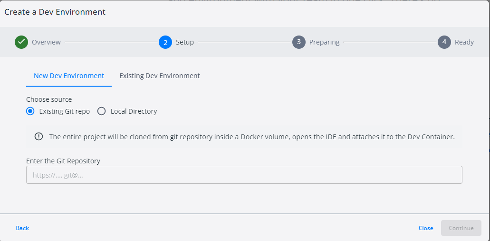
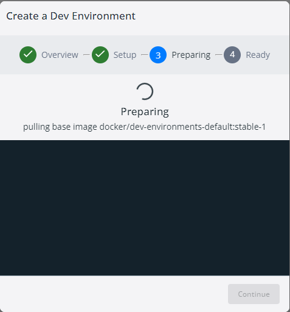
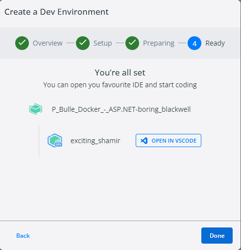

# P_Bulle_Dev_Docker

## Config de docker et des containeurs

### Creation du containeur avec DevEnvironments

Quand vous lancer Docker, vous devez cliquer sur l'icône DevEnvironments à Gauche

Cliquer sur le bouton Create new environment  
  

Cette Fenêtre vous informe juste de Docker Dev Environment. Cliquer sur Get Started  


Vous arrive sur cetee fenêtre. Vous pouvez utiliser sois un projet GIT ou un dossier local. Dans cet documentation je vais utilisé un dossier local.


Vous chochez votre option. Dans le cas d'un dossier local, il faudra choisir un dossier avec le button Select en bas à droite


Après votre dossier choisi. Cliquer sur Continue qui vient d'apparaître.


Vous n'avez à présent plus rien à faire attendez que le téléchargement finisse et cliquer sur continuer.


Voila votre environment de développement à été contenerisée. Vous pouvez l'ouvrir avec votre IDE.


### Commande pour lancer notre application

[env.sh](env.sh)

```bash
# Crée un tableaux des containeurs à supprimmer
containers=('application' 'mysql' 'test')

# Crée un tableaux des images à supprimmer
images=('p_bulle_docker-aspnet-db' 'p_bulle_docker-aspnet-test' 'p_bulle_docker-aspnet-webapp')

# Ecris dans la console une ligne vide
echo ""

# Ecris dans la console le message Supprimmer les conteneurs
echo "Supprimer les conteneurs..."

# Ecris dans la console une ligne vide
echo ""

# Initilise une variable count à la valeur 1
count=1

# Boucle sur le tableaux des containers 
for container in "${containers[@]}"; do
    # Ecris dans la console une ligne vide
    echo ""

    # Ecris dans la consonsole à quelle étape du processus nous sommes
    echo "[Step $count/6] En train de supprimer le conteneur $container..."
    
    # Supprimme le containeur de docker
    docker rm $container

    # Ecris dans la console le containeur supprimmé
    echo "Conteneur $container a été supprimé"

    # Ecris dans la console une ligne vide
    echo ""

    # Fait une barre de progression suivant l'avancer de la tâche
    if [[ $count -eq 1 ]]
    then
        # Ecris dans la console la progression avec la barre et un chiffre
        echo "Progression : [###               ] 16 %"
    elif [[ $count -eq 2 ]]
    then
        # Ecris dans la console la progression avec la barre et un chiffre
        echo "Progression : [######            ] 32 %"
    else
        # Ecris dans la console la progression avec la barre et un chiffre
        echo "Progression : [#########         ] 48 %"
    # Signifie la fin des conditions if...else if...else...
    fi
    # Incrémente de 1 la valeur de count
    ((count++))
# Signifie la fin de la boucle for
done

# Boucle sur le tableaux avec les images
for image in "${images[@]}"; do
    # Ecris dans la console une ligne vide
    echo ""

    # Ecris dans la consonsole à quelle étape du processus nous sommes
    echo "[Step $count/6] En train de supprimer l'image $image..."

    # Supprimme l' image de docker
    docker rmi $image

    # Ecris dans la console l'image supprimmé
    echo "Image $image a été supprimée"

    # Ecris dans la console une ligne vide
    echo ""

    # Fait une barre de progression suivant l'avancer de la tâche
    if [[ $count -eq 4 ]]
    then

        # Ecris dans la console la progression avec la barre et un chiffre
        echo "Progression : [############      ] 64 %"
    elif [[ $count -eq 5 ]]
    then
        # Ecris dans la console la progression avec la barre et un chiffre
        echo "Progression : [###############   ] 80 %"
    else
        # Ecris dans la console la progression avec la barre et un chiffre
        echo "Progression : [##################] 100 %"
    # Signifie la fin des conditions if...else if...else...
    fi
    # Incrémente de 1 la valeur de count
    ((count++))
# Signifie la fin de la boucle for
done

# Ecris dans la console une ligne vide
echo ""

# Confirme à l'utilisateur que les containeurs et images ont été supprimmé
echo "Tous les conteneurs et images ont été supprimés."

# Ecris dans la console un espace vide
echo ""

# Signale à l'utilisateur que le docker-compose va être effectué
echo "Démarrage des services avec docker-compose..."

# Permet de démmarer l'application, la base de données et les tests
docker-compose up

```

### DockerFile

J'ai fait trois Dockerfile
* Pour la base de données
* Pour mon application web
* Pour mes test (MS Test)

Voici le dockerfile pour mon base de données MySQL :

[Dockerfile pour MySQL](../Database/Dockerfile)

```dockerfile
# Prend l'image de base de MySQL
FROM mysql

# Défini le mote de passe de root
ENV MYSQL_ROOT_PASSWORD=root

# Copie le dump dans le dossier /docker-entrypoint-initdb.d
COPY P_Bulle-Docker.sql /docker-entrypoint-initdb.d/

# Expose le port 3306
EXPOSE 3306
```

Voici le dockerfile pour mon application web :

[Dockerfile pour mon application Web](Dockerfile)

```dockerfile
# Cet image est utilisé comme base pour éxecuter des application ASP.NET CORE
FROM mcr.microsoft.com/dotnet/aspnet:6.0 AS base

# Défini le dossier de travaille à /app
WORKDIR /app

# Expose le port 80 en HTTP
EXPOSE 80

# Expose le port 443 en HTTPS
EXPOSE 443

# Prend l'image de sdk pour compiler l'application
FROM mcr.microsoft.com/dotnet/sdk:6.0 AS build

# Défini le dossier de travail à /src
WORKDIR /src

# Copie le fichier .csproj
COPY ["P_Bulle_Docker.csproj", "."]

# Execute cette commande pour restaurer les dépendances
RUN dotnet restore "./P_Bulle_Docker.csproj"

# Copie tout les fichiers dans le répertoire sur la machine dans le containeur
COPY . .

# Défini l'endroit ou seront copié les fichiers
WORKDIR "/src/."

# Execute dotnet build pour faire une release dans le dossier /app/build
RUN dotnet build "P_Bulle_Docker.csproj" -c Release -o /app/build

# Défini une nouvelle étape depuis la précedente
FROM build AS publish

# Execute dotnet publish pour publier l'application et mettre dans le dossier
RUN dotnet publish "P_Bulle_Docker.csproj" -c Release -o /app/publish

# Défini une nouvelle étape depuis la précedante
FROM base AS final

# Change le répertoire de travail à /app
WORKDIR /app

# copie les fichiers depuis le step précedente dans le repo actuelle
COPY --from=publish /app/publish .

# Défini une commande qui sera effecué au moment du lancement du containeur
ENTRYPOINT ["dotnet", "P_Bulle_Docker.dll"]
```

Voici le dockerfile pour mes test avec MSTest :

[Dockerfile pour MSTest](../TestUnitaire/test/Dockerfile)

```dockerfile
# Prend l'image de sdk pour compiler l'application
FROM mcr.microsoft.com/dotnet/sdk:6.0

# Défini le dossier de travail à /app
WORKDIR /app

# Copie le fichier .csproj dans le dossier courant
COPY *.csproj ./

# Restore les dépendances
RUN dotnet restore

# Copie tout les fichiers du local au containeur
COPY . ./

# Publie et mets la dans le dossier out
RUN dotnet publish -c Release -o out

# Au moment de l'éxecution du containeur éxecute dotnet test
ENTRYPOINT [ "dotnet", "test" ]
```

### Docker Compose

Voici mon docker-compose pour créer mes 3 containeurs :

[Docker compose](docker-compose.yml)

```YML

# Défini les différents services
services:
  # Défini un service de db
  db:
    build:
      context: ../Database
      dockerfile: Dockerfile
    container_name: mysql
    ports:
      - '3306:3306'
    volumes:
      - my-db:/var/lib/mysql
  webapp:
    build: 
      context: .
      dockerfile: Dockerfile
    container_name: application
    depends_on:
      - db
    ports:
      - "8080:80"
  test:
    build:
      context: ../TestUnitaire/test
      dockerfile: Dockerfile
    container_name: test
    depends_on:
      - db
      - webapp
volumes:
  my-db:
  
```

## Webographie

### Séquence 1
### Séquence 2
### Séquence 3
### Séquence 4
### Séquence 5
### Séquence 6
### Séquence 7
### Séquence 8